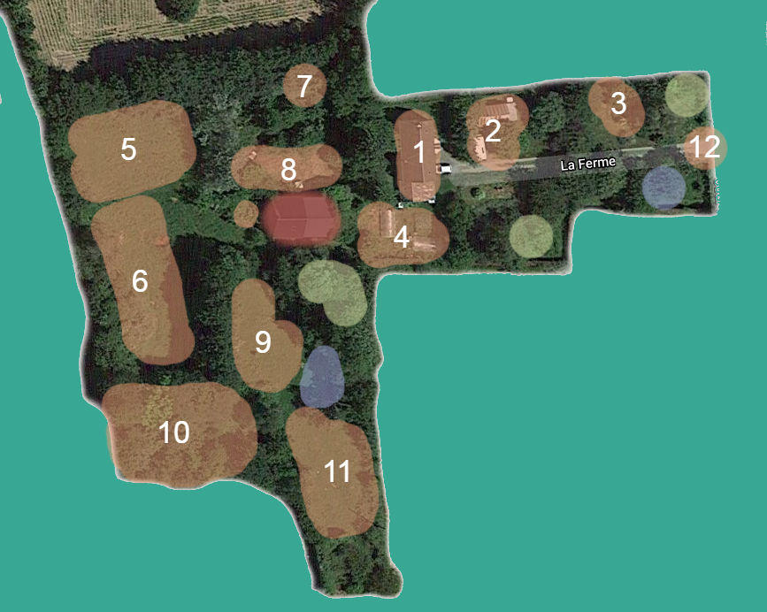
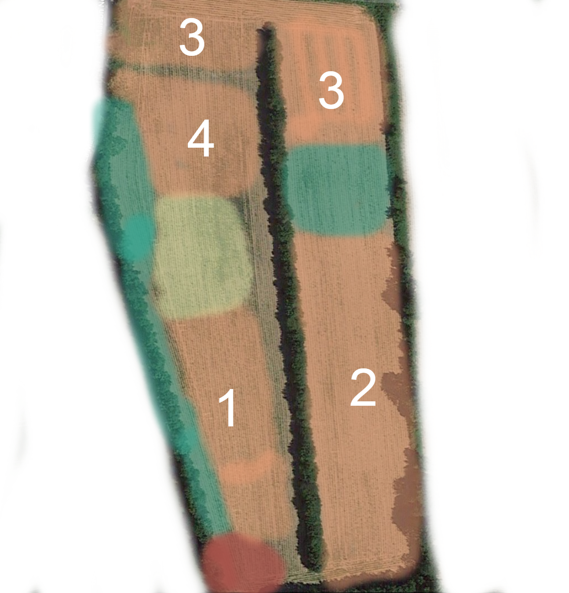
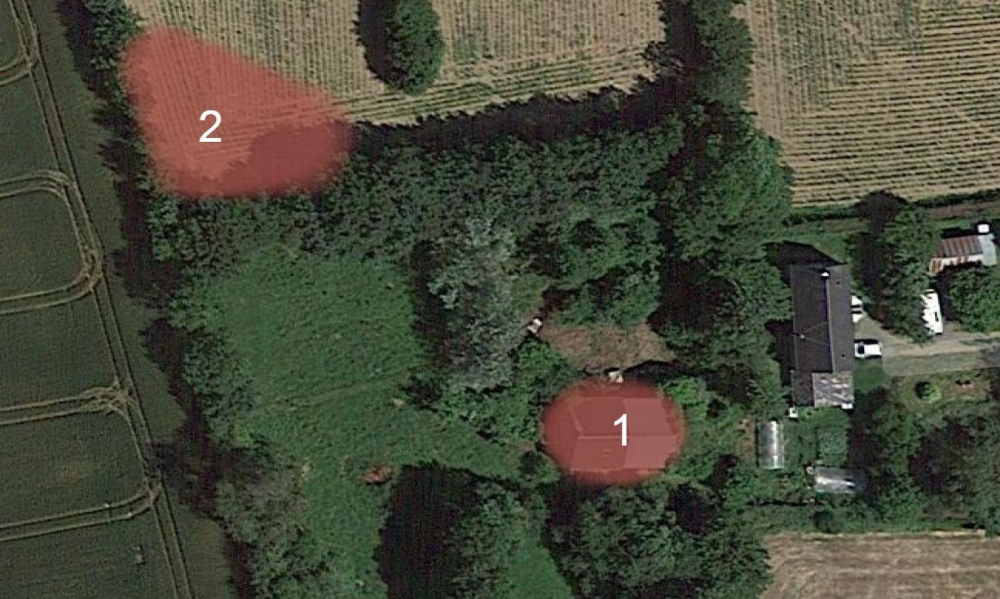

# Plan des espaces

> Le plan des espaces est une annexe du [Manuel du chercheur mallouestanais](Readme.md)

## Les espaces

### Légende

- Orange: Espace réservé
- Vert clair: Espace libre
- Vert: Espace sauvage
- Mauve: Espace Disponible
- Rouge: Espace Privée

## Espaces privés

